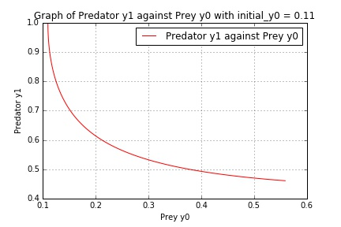

UECM3033 Assignment #3 Report
========================================================

- Prepared by: ** Pan Zi Joon**
- Tutorial Group: T2

--------------------------------------------------------

## Task 1 --  Gauss-Legendre formula

The reports, codes and supporting documents are to be uploaded to Github at: 

[https://github.com/zjpan/UECM3033_assign3](https://github.com/zjpan/UECM3033_assign3)

**Explain how you implement your `task1.py` here.**

Firstly, we need to confirm that the integral over [a,b] is [-1,1] to perform the before Gauss-Legendre integration. This interval transformation can be done as stated below:

$$ u = T(x) = \frac{b-a}{2}x + \frac{b+a}{2} $$

$$\int_a^{b}f(x) dx= \frac{b-a}{2}\int_{-1}^{1} f(\frac{b-a}{2}x + \frac{a+b}{x} ) dx$$

After applying the Gaussian quadrature rule, it will  results in the approximation as stated below:

$$\int_a^{b}f(x) dx= \frac{b-a}{2}\sum_{i=1}^{n} w_i f(\frac{b-a}{2}x_i + \frac{a+b}{x} ) $$

It can be done via the codes to perform the calculation as stated below:

y = (b-a)* x/2 + ((b+a)/2)
ans = ((b-a)/2)*np.dot (w, f(y))

**Explain how you get the weights and nodes used in the Gauss-Legendre quadrature.**

$$ x_i $$ and $$ w_i $$ can be obtained using the polynomial module in python. The function is stated below.

x,w = np.polynomial.legendre.leggauss(n)

---------------------------------------------------------

## Task 2 -- Predator-prey model

**Explain how you implement your `task2.py` here, especially how to use `odeint`.**

A ODE system (ode) is created and the following differential equations is defined in the system.

$$ y'_0 = a(y_0 - y_0 y_1)$$ $$ y'_1 = b(-y_1 + y_0 y_1)$$

Then, I stored the given value into a,b and y. Then the linspace function, *t = np.linspace(0,5,101)* is used to plot a smooth line graph for the time 0 to 5 years.

Later, the odeint module in python,  *sol = spIn.odeint(ode,ini_y,t,args=(a,b))* is used to solve the ODE system. 

**Put your graphs here and explain.**

This is the graph of Prey y0 and Predator y1 against Year t, where the initial condition is y0 = 0.1, y1 = 1.0. We can see that the number of prey increase when the number of predator decreases.

This is the graph of Predator y1 against Prey y0, where the initial condition is y0 = 0.1, y1 = 1.0. We can see that there is a inverse relationship between y0 and y1.

This is the graph of Prey y0 and Predator y1 against Year t, where the initial condition is y0 = 0.11, y1 = 1.0

This is the graph of Predator y1 against Prey y0, where the initial condition is y0 = 0.11, y1 = 1.0

**Is the system of ODE sensitive to initial condition? Explain.**

This system of ODE is not sensitive to the initial condition. There is only a small change (small difference) between the graph when the initial value condition change from 0.1 to 0.11.

-----------------------------------

last modified: 17 April 2016
